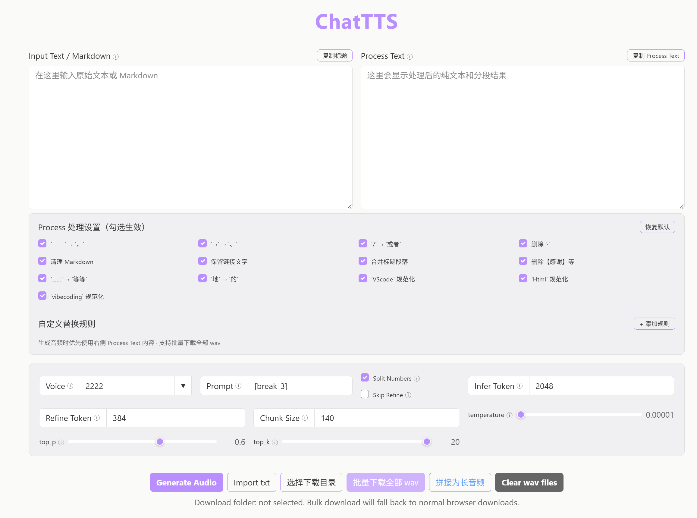

# ChatTTS Long-Audio Generation Tool

A local text-to-speech tool based on [ChatTTS](https://github.com/2noise/ChatTTS) and [chatTTS-ui](https://github.com/jianchang512/chatTTS-ui). It provides a web UI and API, focusing on solving **long-audio generation** and **mispronunciation of numbers, English words, jargon, and special symbols**.

## Upstream Projects

This project is built on top of:

- [2noise/ChatTTS](https://github.com/2noise/ChatTTS): the underlying TTS model and inference code.
- [jianchang512/chatTTS-ui](https://github.com/jianchang512/chatTTS-ui): local WebUI and API interface.

## Why This Project?

When using the original ChatTTS and chatTTS-ui, we encountered several pain points in video production:

1. **ChatTTS has no UI and is cumbersome to launch.**  
   It requires manually running scripts and configuring the environment, which is unfriendly to non-technical users.

2. **Unable to stably generate long audio.**  
   Video narration and audiobooks often have very long scripts. Feeding the whole text at once usually causes noise, slurred speech, or even unlistenable output after a certain length. Manual splitting and merging is tedious.

3. **Jargon, English, numbers, and special symbols are often mispronounced.**  
   Finance/tech terms, English words, phone numbers, decimals, percentages, and formulas are frequently read incorrectly in a Chinese-style manner.

## Key Improvements

### 1. One-Click Local WebUI
- Inherits the web interface from chatTTS-ui; start the service by double-clicking a batch script.
- Open `http://localhost:9966` in your browser.

### 2. Automatic Long-Audio Splitting and Merging
- `app.py` automatically splits text by lines/punctuation, infers each chunk, and merges them into a single continuous audio file.
- `chattts_api_client.py` provides a CLI example: input a long text, split it into chunks, call the local `/tts` API in batches, and merge the results with proper silence padding.
- Suitable for 5-minute, 10-minute, or even longer narrations.

### 3. Text Preprocessing: Numbers, English, and Special Symbols
- `uilib/utils.py` integrates Chinese/English text normalization:
  - Numbers (integers, decimals, percentages, phone numbers, dates, times, arithmetic expressions) are converted to speech-friendly forms.
  - English words and digit sequences are read in English instead of Chinese-style gibberish.
  - Overly long sentences are split by punctuation to avoid quality degradation from excessive tokens.

### 4. Voice Management
- The `speaker/` directory contains preset voice embeddings (e.g. 3798 and other commonly used voices).
- In the WebUI or API, set the `voice` parameter to a numeric seed (e.g. `2222`, `3798`) or a voice filename under `speaker/` (e.g. `3798.csv`).
- The default voice shown when opening the WebUI can be changed via the `DEFAULT_VOICE` environment variable. The repository defaults to `2222`; set it to `3798` in your local `.env` file if desired.

## Directory Structure

```text
ChatTTS/                # ChatTTS inference code (from upstream)
app.py                  # Main service: WebUI + /tts API
chattts_api_client.py   # Example script for long-text batch generation / merging
uilib/                  # Utilities: text normalization, voice loading, parameter handling
uilib/zh_normalization/ # Chinese text normalization module
speaker/                # Preset voice files
static/workbench.html   # Main web workbench
templates/              # Flask templates
requirements.txt        # Python dependencies
.env.example            # Environment variable example
_run_app.bat            # Windows one-click launch script (source mode, kills old process and logs output)
_run_app_py.bat         # Simplified launch script
```

## Interface Preview



## Requirements

- Windows (source deployment)
- Python 3.10–3.11
- GPU: NVIDIA GPU with 4GB+ VRAM for CUDA acceleration; otherwise CPU is used

## Installation and Launch

### 1. Clone the repository

```bash
git clone <your-repo-url>.git
cd ChatTTS-LongAudio
```

### 2. Create a virtual environment and install dependencies

```bash
python -m venv venv
venv\Scripts\activate.bat
pip install -r requirements.txt
```

> For GPU acceleration, additionally install CUDA 11.8+ PyTorch, e.g.:  
> `pip install torch==2.2.0 torchaudio==2.2.0 --index-url https://download.pytorch.org/whl/cu118`

### 3. Copy environment variables

```bash
copy .env.example .env
```

### 4. Start the service

Option 1: double-click:

```text
_run_app.bat
```

Option 2: command line:

```bash
venv\Scripts\activate.bat
python app.py
```

On the first run, the ChatTTS model will be automatically downloaded to `models/` (about 1GB+, already excluded from Git by `.gitignore`).

After startup, open:

```text
http://localhost:9966
```

## API Usage Example

### Long-audio batch generation

```bash
python chattts_api_client.py "Hello, this is the first paragraph. This is the second paragraph, used to test long audio merging."
```

The script will:
1. Split the text by sentences/length;
2. Call `http://127.0.0.1:9966/tts` chunk by chunk;
3. Download each segment to `output/`;
4. Merge them into one continuous audio file with 0.5-second silence gaps.

### Direct /tts API call

```python
import requests

res = requests.post('http://127.0.0.1:9966/tts', data={
    "text": "Hello, this is a long-audio generation test.",
    "prompt": "[break_3]",
    "voice": "3798",
    "temperature": 0.00001,
    "top_p": 0.6,
    "top_k": 20,
    "skip_refine": 0,
})
print(res.json())
```

## Common Parameters

Environment variables:

| Variable | Default | Description |
| --- | --- | --- |
| `WEB_ADDRESS` | `localhost:9966` | Service listen address |
| `compile` | `false` | Whether to enable torch.compile |
| `DEFAULT_VOICE` | `2222` | Default voice seed or filename under `speaker/` |

API parameters:

| Parameter | Default | Description |
| --- | --- | --- |
| `text` | - | Text to synthesize (required) |
| `voice` | `2222` | Voice seed or voice filename under `speaker/`, e.g. `3798`, `3798.csv` |
| `temperature` | `0.3` | Sampling temperature |
| `top_p` | `0.7` | top_p |
| `top_k` | `20` | top_k |
| `skip_refine` | `0` | Whether to skip text refine |
| `infer_max_new_token` | `2048` | Max inference tokens |
| `refine_max_new_token` | `384` | Max refine tokens |

## Notes

1. **Model files**: `models/` is downloaded automatically on first run (about 1GB+) and is excluded from Git by `.gitignore`.
2. **Generated files**: `output/`, `static/wavs/`, and `logs/` are runtime outputs and are excluded from Git.
3. **Voice files**: `.csv`/`.pt` files in `speaker/` are small voice embeddings and can be committed with the repository.
4. **Binary releases**: If you want to provide a standalone `.exe`, please distribute it via GitHub Releases instead of committing it to the repository.

## License

This project inherits the license of its upstream projects. See [LICENSE](LICENSE).

## Acknowledgements

Thanks to [2noise/ChatTTS](https://github.com/2noise/ChatTTS) and [jianchang512/chatTTS-ui](https://github.com/jianchang512/chatTTS-ui) for their open-source contributions.
